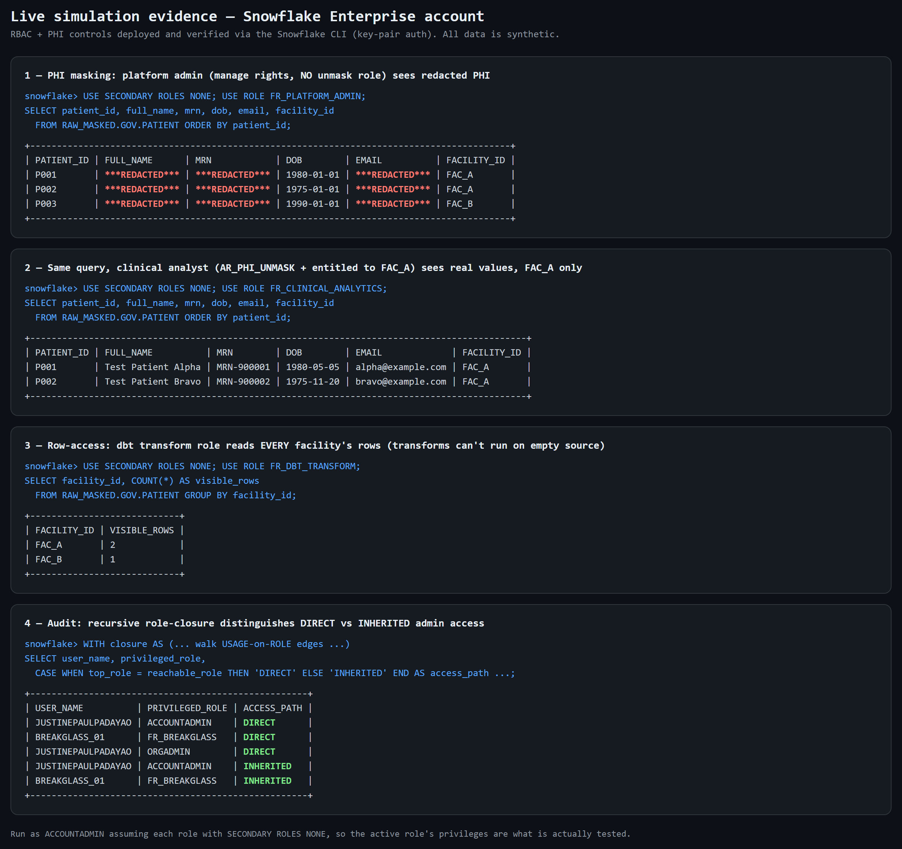

# Validation Evidence

The platform's access controls were **deployed and verified on a Snowflake Enterprise account**,
driven over the Snowflake CLI with **key-pair authentication**. This page records what was validated
and the evidence. All data is synthetic.

## Live simulation

The model was deployed on a real Snowflake Enterprise account and the controls were exercised role by
role. The screenshot below is the actual output — PHI masking (admin redacted vs clinical clear-text),
row-access scoping, dbt full-row reads, and the DIRECT-vs-INHERITED audit:



## Validation gates (defense in depth)

| Gate | Tool | What it caught |
|---|---|---|
| 1. Static syntax | SQLFluff (`--dialect snowflake`) | A block-comment that closed early because a comment contained `*/` (`FR_*/AR_*`), turning SQL into unparsable text. |
| 2. Live execution | Snowflake Enterprise trial via `snow` CLI | `UNION` inside a recursive CTE — Snowflake requires `UNION ALL`. Static linting could not detect this; only real execution did. |
| 3. Behavioral proof | Live queries as each role | Masking, row-access, and least-privilege all behave as designed (below). |

Syntax linting and live execution each catch what the other cannot. A subsequent control review
surfaced further fixes, all re-validated on the live account:

- **dbt transforms now read all rows** — the row-access policy previously returned zero rows to the
  transform role; confirmed dbt reads every row (FAC_A=2, FAC_B=1) while clinical analysts remain
  scoped to their entitled facility (FAC_A only).
- **Tighter separation of duties** — admin roles inherit neither PHI clear-text (`AR_PHI_UNMASK`)
  nor policy authorship (`AR_GOV_ADMIN`), which is split into a dedicated governance role.
- **Correct audit evidence** — the role-closure now distinguishes DIRECT vs INHERITED access
  (previously every row was labelled DIRECT), and the monthly PHI-entitlement queries follow role
  inheritance so SCIM-provisioned humans are not missed.

## Environment

- Snowflake **Enterprise** edition trial (masking / row-access / tags require Enterprise).
- Connected as `ACCOUNTADMIN` via `snow` CLI, **key-pair (JWT) auth** — no password used.
- `snowflake_rbac.sql` executed end-to-end: **~150 statements, 0 errors** (warehouses, resource
  monitors, managed-access schemas, tags, masking + row-access policies, the full `AR_*`/`FR_*`
  role model, key-pair service users, and a synthetic PATIENT table with policies applied).

## Behavioral evidence

Three synthetic patients were seeded (`Test Patient Alpha/Bravo/Charlie`, `MRN-900xxx`,
non-collidable). `FR_CLINICAL_ANALYTICS` was entitled to facility `FAC_A` only.

### 1. Dynamic data masking + separation of duties — the same query, two roles

**`FR_PLATFORM_ADMIN`** (can read raw, but holds **no** `AR_PHI_UNMASK`):

```
PATIENT_ID | FULL_NAME      | MRN            | DOB        | EMAIL          | FACILITY_ID
P001       | ***REDACTED*** | ***REDACTED*** | 1980-01-01 | ***REDACTED*** | FAC_A
P002       | ***REDACTED*** | ***REDACTED*** | 1975-01-01 | ***REDACTED*** | FAC_A
P003       | ***REDACTED*** | ***REDACTED*** | 1990-01-01 | ***REDACTED*** | FAC_B
```

**`FR_CLINICAL_ANALYTICS`** (holds `AR_PHI_UNMASK`, entitled to `FAC_A`):

```
PATIENT_ID | FULL_NAME          | MRN        | DOB        | EMAIL             | FACILITY_ID
P001       | Test Patient Alpha | MRN-900001 | 1980-05-05 | alpha@example.com | FAC_A
P002       | Test Patient Bravo | MRN-900002 | 1975-11-20 | bravo@example.com | FAC_A
```

This single comparison demonstrates four controls at once:
- **Tag-based masking** — string PHI shows `***REDACTED***` for the unprivileged role.
- **Date generalization** — DOB collapses to `YYYY-01-01`.
- **Separation of duties** — the platform admin holds neither the unmask role nor account-wide
  policy-apply, so it cannot read PHI clear-text (nor silently detach a masking policy to do so;
  policy authorship is a separate governance role and such changes are logged/alerted).
- **Row-access policy** — the clinical analyst sees only `FAC_A` rows (P003/`FAC_B` filtered out).

### 2. Least privilege — general analyst is denied raw PHI entirely

`FR_ANALYST` selecting from the raw schema:

```
002003 (02000): SQL compilation error:
Database 'RAW_MASKED' does not exist or not authorized.
```

General analysts cannot even see the PHI database — not "can see but masked," but no access at all.

### 3. Control-existence evidence (for the monthly access review)

`INFORMATION_SCHEMA.POLICY_REFERENCES` on the PATIENT table:

```
POLICY_NAME   | POLICY_KIND       | REF_COLUMN_NAME
MP_PHI_DATE   | MASKING_POLICY    | DOB
MP_PHI_STRING | MASKING_POLICY    | EMAIL
MP_PHI_STRING | MASKING_POLICY    | FULL_NAME
MP_PHI_STRING | MASKING_POLICY    | MRN
RAP_FACILITY  | ROW_ACCESS_POLICY | (table)
```

This is exactly the kind of evidence a monthly access review attaches to prove PHI columns are
protected (see `audit_queries.sql` §7d).

### 4. Audit queries run on real Snowflake

The recursive role-closure query (`audit_queries.sql` §1–2) was executed and returns results
(after the `UNION ALL` fix). Note: `SNOWFLAKE.ACCOUNT_USAGE` views lag **up to ~2 hours**, so
immediately after setup the grant-history queries return sparse rows — `SHOW GRANTS` and
`INFORMATION_SCHEMA` were used for real-time evidence, and the `ACCOUNT_USAGE` queries are valid and
populate within the latency window. This latency is documented in `audit_queries.sql`.

## Reproducing

`snow` CLI with key-pair auth; run `snowflake_rbac.sql`, seed the synthetic rows, then the evidence
queries (the full step list is kept in internal runbooks). It runs on an XS warehouse, so credit
burn is negligible.
